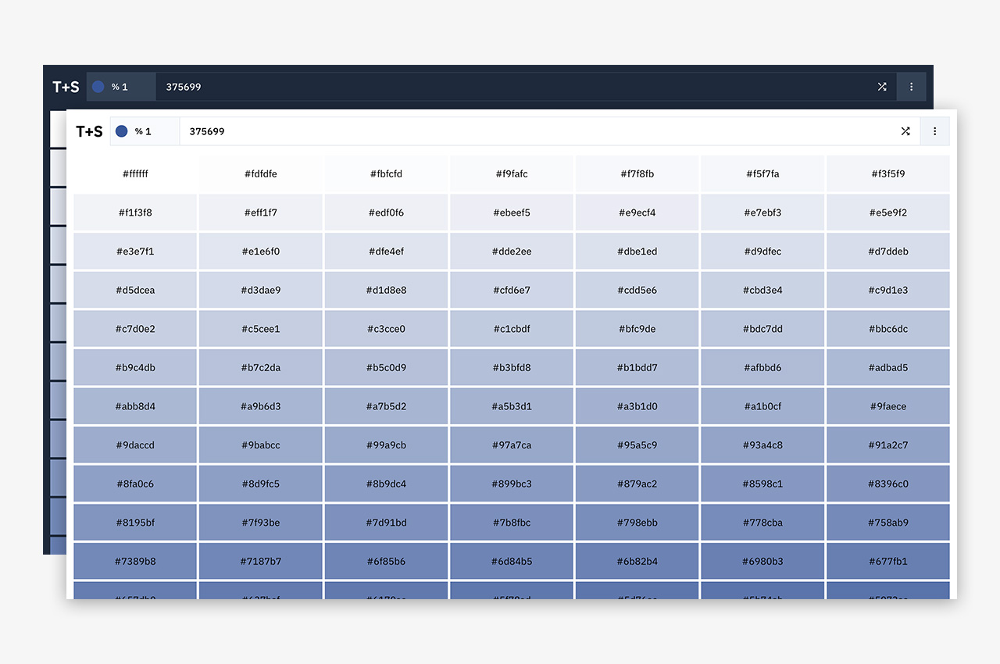

# Tints & Shades
This tool helps you generate tints and shades for a given hex color.

## Usage

1. Input a hex color code either by typing it in manually or by using the color picker available at the top panel.
2. Choose a percentage value by which the tints and shades should be generated. You can select any value from 1 to 100.
3. Hit 'Return' to generate the tints and shades. Use the 'Shuffle' button to select a random color.

## Screenshot

## Credits

1. Tints & shades provided by [Hexashades](https://github.com/arjunkdot/hexashades).
2. Icon courtesy [React Icons](https://react-icons.github.io/react-icons/).
3. Copy to clipboard functionality by [react-copy-to-clipboard](https://github.com/nkbt/react-copy-to-clipboard/).
4. Color contrast by [color-contrast](https://github.com/jescalan/color-contrast/).
5. Color picker by [React Color](http://casesandberg.github.io/react-color/).
6. Cookie management by [js-cookie](https://github.com/js-cookie/js-cookie#readme).

### License
MIT &copy; [arjunkdot](https://github.com/arjunkdot/)